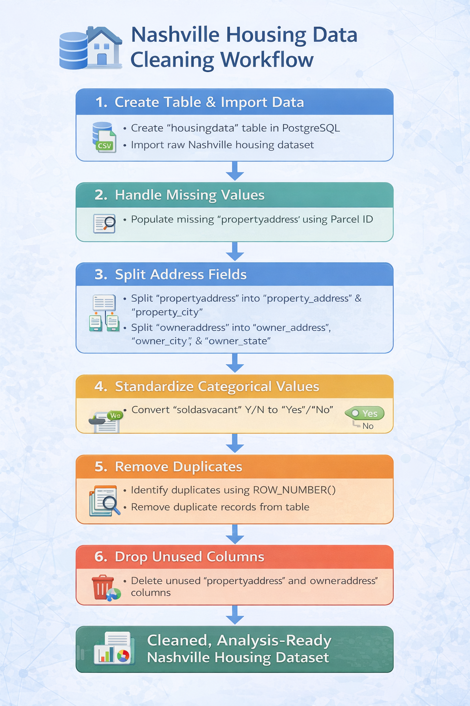

# Nashville Housing Data Cleaning — SQL

PostgreSQL data cleaning pipeline that transforms 56,000+ raw Nashville housing transaction records into a fully structured, analysis-ready dataset using self-joins, window functions, and CTEs.

---

## Project Overview

Raw real estate transaction data is rarely clean enough to analyse directly. This project demonstrates a full SQL-based data cleaning workflow on the Nashville Housing dataset — transforming a messy source into a reliable, structured dataset ready for downstream analysis, BI dashboards, or price trend modelling.

Every transformation is performed entirely in PostgreSQL. No external scripting tools required. The techniques applied here — deduplication, self-joins, window functions, NULL handling — map directly to the data engineering work that sits beneath any reliable analytics pipeline.

---

## Dataset

- **Source:** Publicly available Nashville housing sales transaction records
- **Size:** 56,000+ rows
- **Key fields:** Parcel ID, Property Address, Owner Name/Address, Sale Date, Sale Price, Legal Reference, Acreage, Year Built, Bedroom/Bathroom counts, Property Value details

**Raw data quality issues present:**
- Missing property addresses
- Combined address fields (address + city + state in a single column)
- Inconsistent categorical values (`Y` / `N` instead of `Yes` / `No`)
- Duplicate transaction records
- Redundant columns

---

## Approach

The cleaning workflow was performed in five stages entirely in PostgreSQL:

### 1. Handling Missing Values
Identified rows with null `PropertyAddress`. Populated them via a self-join on matching `ParcelID` values — if two rows share a parcel ID, the non-null address can fill the null one.

### 2. Address Standardisation
Split combined `PropertyAddress` and `OwnerAddress` fields into discrete columns using `SPLIT_PART`, `SUBSTRING`, and `POSITION`:
- `PropertyAddress` → `Property_Address`, `Property_City`
- `OwnerAddress` → `Owner_Address`, `Owner_City`, `Owner_State`

### 3. Data Consistency
Standardised the `SoldAsVacant` column using `CASE` statements: `Y` → `Yes`, `N` → `No`.

### 4. Duplicate Removal
Identified duplicate records using `ROW_NUMBER()` window functions partitioned by `ParcelID`, `PropertyAddress`, `SalePrice`, `SaleDate`, and `LegalReference`. Deleted all rows where `ROW_NUMBER > 1`.

### 5. Column Cleanup
Dropped the original combined address columns (`PropertyAddress`, `OwnerAddress`) after splitting was complete.

**Before vs After:**

| Raw Schema | Cleaned Schema |
|------------|----------------|
| Combined `PropertyAddress` | Split into `Property_Address`, `Property_City` |
| Combined `OwnerAddress` | Split into `Owner_Address`, `Owner_City`, `Owner_State` |
| `SoldAsVacant` (Y/N) | `SoldAsVacant` (Yes/No) |
| Missing property addresses | Populated via self-join |
| Duplicate records | Removed via window functions |
| Redundant columns | Dropped |

<p align="center">
  
</p>

---

## Key Findings

- Self-joins can fill missing address data without external lookup tables — shared `ParcelID` values act as a reliable key when address fields are null
- `ROW_NUMBER()` partitioned window functions are the most reliable SQL pattern for identifying and removing duplicates while preserving one clean record per group
- Splitting address fields into discrete columns at the cleaning stage significantly reduces complexity in all downstream queries
- Standardising categorical values (`Y/N` → `Yes/No`) at ingestion prevents silent errors in `GROUP BY` aggregations and filters
- The cleaned dataset is directly usable for housing price trend analysis, geographic segmentation, and BI dashboard development

**SQL concepts used:** `CREATE TABLE`, `ALTER TABLE`, `UPDATE` with `JOIN`, `COALESCE`, `SUBSTRING`, `POSITION`, `SPLIT_PART`, `TRIM`, `CASE`, CTEs, `ROW_NUMBER()`, Window Functions, `DELETE` with `USING`

---

## How to Run

Requires **PostgreSQL 12+**.

```bash
git clone https://github.com/SamadZaheer/Nashville-Housing-Data-Cleaning---SQL.git
cd Nashville-Housing-Data-Cleaning---SQL

# Import the dataset into your PostgreSQL database
psql -U your_username -d your_database -c "\copy nashville_housing FROM 'Nashville Housing Data.csv' CSV HEADER"

# Run the cleaning script
psql -U your_username -d your_database -f "Nashville Housing Data.sql"
```

> This is a pure SQL project — no Python environment required.

---

## Author

**Samad Zaheer** — Master of Information Technology (Data Science), Queensland University of Technology (QUT)
