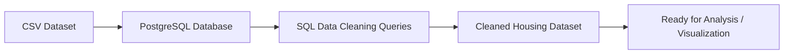

# Nashville Housing Data Cleaning using PostgreSQL

## Project Overview

This project focuses on cleaning and transforming the Nashville Housing dataset using PostgreSQL in order to prepare raw real estate transaction data for analysis.

The main objective of this project is to:

- Import real-world housing dataset into PostgreSQL
- Perform data preprocessing and cleaning
- Handle missing property address values
- Standardize categorical variables
- Split combined address columns
- Remove duplicate records
- Restructure dataset for analysis

This project demonstrates an end-to-end SQL data cleaning workflow that is commonly required before performing exploratory data analysis or building BI dashboards.

---

## Dataset Description

The dataset contains housing sales transaction records from Nashville, including:

- Parcel ID
- Property Address
- Sale Date
- Sale Price
- Legal Reference
- Owner Information
- Acreage
- Property Value Details
- Year Built
- Bedroom and Bathroom Counts

The raw dataset contains:

- Missing property addresses
- Combined address fields
- Inconsistent categorical values
- Duplicate records
- Unnecessary columns

which makes it suitable for demonstrating real-world SQL data cleaning techniques.

---

## Project Workflow

The following workflow outlines the key steps performed in this project:

- Created structured PostgreSQL table for Nashville Housing dataset
- Populated missing property address values using self-join
- Split property and owner address fields into separate columns
- Standardized categorical values in SoldAsVacant column
- Removed duplicate transaction records using Window Functions
- Deleted unused columns for improved schema structure

---

## Data Cleaning Process

The following cleaning steps were performed to prepare the dataset:

### 1. Handling Missing Values
- Identified missing property addresses
- Populated null property address values using matching Parcel IDs

### 2. Address Standardisation
- Split Property Address into:
  - Property Address
  - Property City
- Split Owner Address into:
  - Owner Address
  - Owner City
  - Owner State

### 3. Data Consistency
- Converted categorical values in `SoldAsVacant`
  - Y → Yes
  - N → No

### 4. Duplicate Removal
- Identified duplicate records using:
  - Parcel ID
  - Property Address
  - Sale Price
  - Sale Date
  - Legal Reference
- Removed duplicate rows using SQL Window Functions (`ROW_NUMBER()`)

### 5. Column Cleanup
- Dropped unused columns:
  - PropertyAddress
  - OwnerAddress

  

---

## Before vs After Data Cleaning Schema

The table below highlights how the dataset structure was improved after applying SQL data cleaning techniques.

| Raw Dataset Schema | Cleaned Dataset Schema |
|--------------------|------------------------|
| PropertyAddress | Property_Address |
| OwnerAddress | Owner_Address |
| Combined Address Fields | Split into Address, City, State |
| SoldAsVacant (Y/N) | SoldAsVacant (Yes/No) |
| Duplicate Records Present | Duplicate Records Removed |
| Missing Property Address Values | Missing Values Populated |
| Unstructured Address Data | Structured Address Columns |
| Redundant Columns Present | Unused Columns Dropped |

This transformation improves:

- Data consistency
- Query performance
- Schema readability
- Analytical usability

---

## SQL Concepts Used

The following SQL concepts were implemented in this project:

- CREATE TABLE
- ALTER TABLE
- UPDATE with JOIN
- COALESCE
- SUBSTRING
- POSITION
- SPLIT_PART
- TRIM
- CASE Statements
- Common Table Expressions (CTEs)
- ROW_NUMBER()
- Window Functions
- DELETE with USING clause
- Data Transformation

---

## Final Outcome

After cleaning, the dataset:

- Contains no duplicate records
- Has standardized categorical values
- Has structured address fields
- Has improved data consistency
- Is ready for analysis or dashboard development

The cleaned dataset can now be used for:

- Housing price trend analysis
- Geographic real estate analysis
- Property value comparison
- Market segmentation studies

---

## Future Improvements

- Convert numeric text fields into appropriate data types
- Create indexes for performance optimization
- Build analytical views for reporting
- Connect dataset to BI tools such as:
  - Power BI
  - Tableau
- Perform exploratory data analysis

---

## Author

### Samad Zaheer

Master of Information Technology (Data Science)  
Queensland University of Technology (QUT)